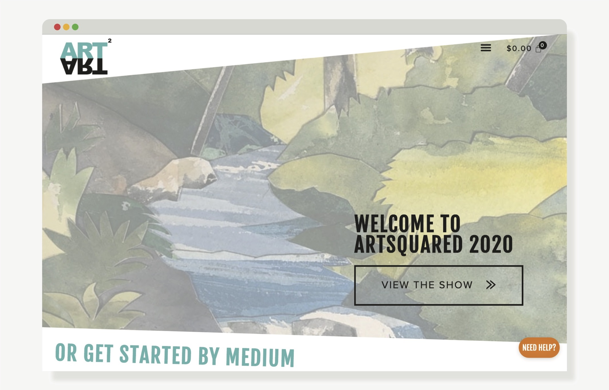
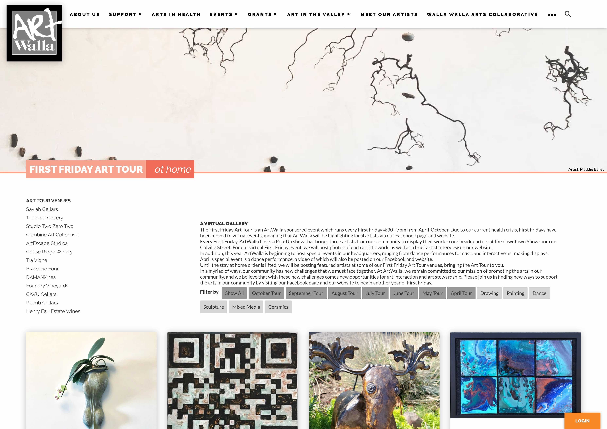
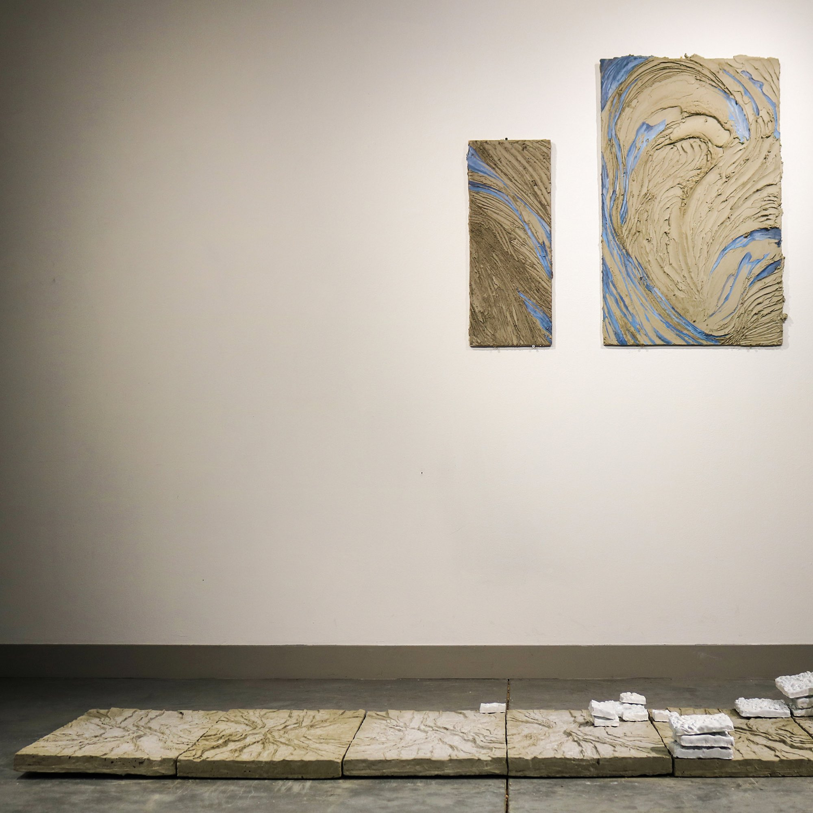

# ArtWalla
* 
* [ArtWalla](https://artwalla.com/) was in need a major facelift to their organization and membership site. I created a custom theme and information organizing strategy to update their web presence and provide an easy interface for ArtWalla members to access their online profiles. The custom theme integrates with their pre-existing WildApricot membership platform to fetch and display member information.

	After implementing the new site, ArtWalla saw an increase in site traffic and membership applications performed online.
	
	WildApricot, ArtWalla's membership and hosting platform, took notice of the site and featured ArtWalla in its monthly [organization spotlight](https://www.wildapricot.com/blogs/newsblog/2020/07/27/july-update-2020).

	Technologies: HTML, CSS, Javascript, WildApricot

<!--secondary images-->

* 
* Responsive mobile experience
*  
* Version 1 iteration of artwalla.com

<!--put category tag here-->

## web

# ArtSquared Walla Walla
* 
* [ArtSquared](https://artsquaredwallawalla.com/) is an annual community art show and sale that serves as [ArtWalla's](https://artwalla.com/) primary fundraiser. Due to community COVID-19 guidelines, ArtWalla could not host a physical event, so I was asked to create a standalone online store to showcase 130 participating artists. I worked closely with the ArtSquared committee to translate the hallmarks of the annual event into a virtual experience.

	We decided that the site must unique to ArtSquared, fast, and remarkable. To that end, finding the right platform would make all the difference. I selected Wordpress with Woocommerce was for its extensibility and vast plugin library. The site runs on a custom child theme paired with Elementor's editor UI for easy content management. 

	Over the course of opening week, the store generated more than $25,0000 in sales and sold 70% of inventory. 

	Techologies: CSS, Javascript, Wordpress, Woocommerce, Elementor

<!--secondary images-->

*  
* Randomized gallery reimagined the traditional event experience

<!--put category tag here-->

## web

# Arts in Health
* 
* [Arts in Health: First Aid Art Kits](https://artwalla.com/artshealth) is a local intiative founded by [Augusta Sparks Farnum](http://augustasparks.com), an artist in Walla Walla. In partnership with Providence St. Mary Medical Center, Augusta coordinated with other local artists to make art kits and prompts for COVID-19 patients in hospital and home quarantine. She approached ArtWalla to create an online component to house the video portion of the art kits.

	I created a static page and UI on artwalla.com to serve as the organization's website, tutorial archive and donation portal.

	Relevant Articles: *[Union Bulletin](https://www.union-bulletin.com/art-kits/article_58215177-5997-5086-bb07-16197bd73431.html)*, *[Art Place](https://www.artplaceamerica.org/blog/first-responder-first-aid-arts-kit)*, *[University of Florida](https://arts.ufl.edu/in-the-loop/news/arts-in-medicine-student-provides-art-kits-to-covid-19-patients/)*

<!--secondary images-->

*  
* Responsive mobile experience

<!--put category tag here-->

## web

# ArtWalla Art Tour
* 
* Lorem ipsum dolor sit amet, consectetur adipiscing elit. Pellentesque vulputate laoreet dui, sit amet gravida risus cursus nec. Sed eu mi commodo nunc sodales rhoncus. Integer facilisis odio magna, eu porttitor ex aliquam sed. Nullam gravida ex tincidunt magna venenatis tincidunt. Aliquam turpis ligula, lobortis id malesuada scelerisque, hendrerit quis nunc. Quisque fermentum ac eros ac consequat. Sed lobortis tempus dolor, nec condimentum lacus tempus sed.

<!--secondary images-->

*  
* Responsive mobile experience

<!--put category tag here-->

## web

# Dia de Los Muertos
* 
* Lorem ipsum dolor sit amet, consectetur adipiscing elit. Pellentesque vulputate laoreet dui, sit amet gravida risus cursus nec. Sed eu mi commodo nunc sodales rhoncus. Integer facilisis odio magna, eu porttitor ex aliquam sed. Nullam gravida ex tincidunt magna venenatis tincidunt. Aliquam turpis ligula, lobortis id malesuada scelerisque, hendrerit quis nunc. Quisque fermentum ac eros ac consequat. Sed lobortis tempus dolor, nec condimentum lacus tempus sed.

<!--secondary images-->

*  
* Responsive mobile experience

<!--put category tag here-->

## web

# peteeberle.com
* 
* My portfolio site is a static HTML page married to a handcrafted Javascript CMS that parses and renders a markdown text file in my Github repository. The simple markdown file contains my project posts and their unique tags, which generate filter options on the client side. This approach safeguards against errors that often occur when manually adding bulk content to a static HTML page.

	Parsing is accomplished by integrating the [CommonMark JS library](https://github.com/commonmark/commonmark.js) created by John MacFarlane.

	Technologies: HTML, CSS, Javascript, JQuery, p5.js

<!--secondary images-->

<!--put category tag here-->

## web

# Alluvium
* 
* At the climax of our self-destructive relationship with nonhuman sites and bodies, *Alluvium* recalls a dissociated image of a floodplain, a source of vital soils and nourishing waters, and renders a barren, facsimiled landscape in its place. Echoes of topographic and stratigraphic systems are reproduced through the precise logic of industrial cement casting, a process designed to cover swaths of excavated land in a repeated rock face or texture, camouflaging inherent destruction. With its contrived technique laid bare, fallible, and delicate, Alluvium craves a new tenderness, if possible, between humans and nature.

	*Alluvium* was exhibited in the [Whitman College 2020 Virtual Senior Art Thesis Show](https://sheehangallerythesisshow2020.com). The original project plans were intended for large scale installation in the Sheehan Gallery, but due to the advent of COVID-19 campus shutdowns, I completed my thesis at home.

	Materials: cast cement, clay, shellac, mortar & oil paint on board

<!--secondary images-->

*  
* front
* 
* wall detail
* 
* floor detail

<!--put category tag here-->

## art

# Builtscape
* 
* *Builtscape* pilfers the traditional image of romantic landscape painters - billowing clouds, sharp mountain peaks, an upwards-oriented composition - and renders it   

	Materials: lineoleum relief

<!--secondary images-->

<!--put category tag here-->

## art

