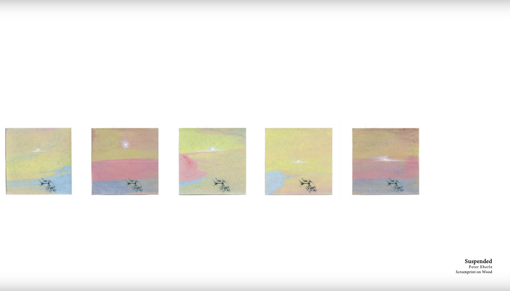
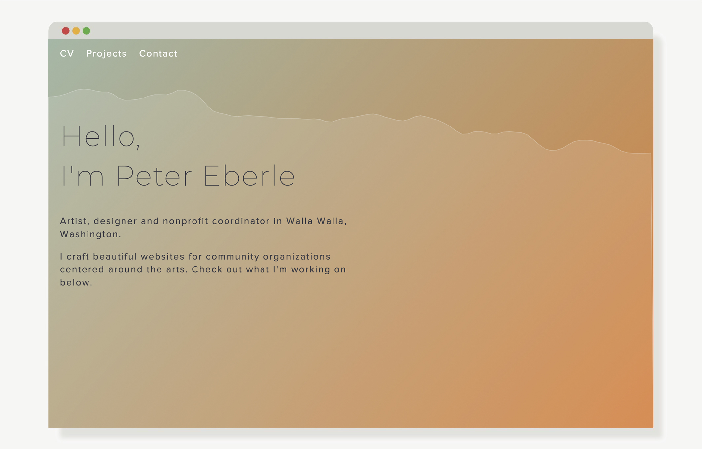
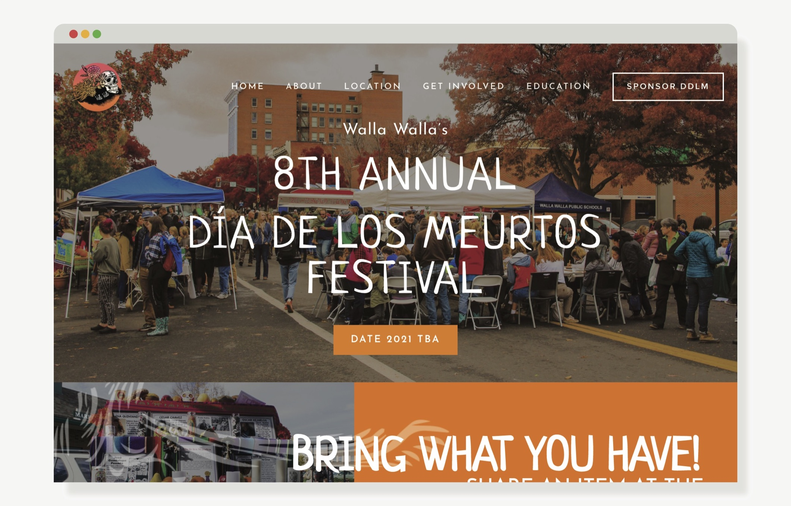
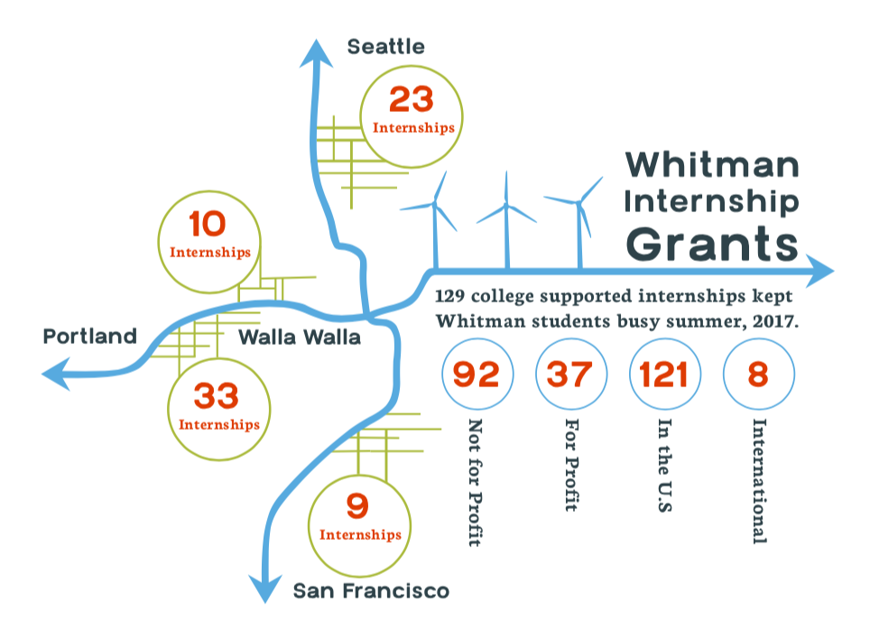
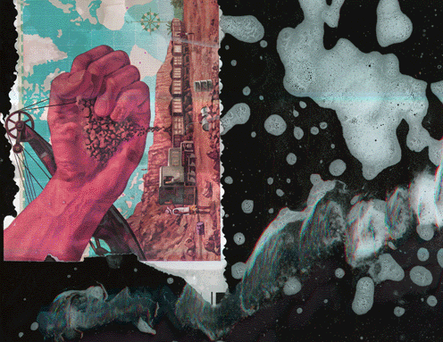

# ArtWalla
* 
* [ArtWalla](https://artwalla.com/) was in need a major facelift to their organization and membership site. I created a custom theme and information organizing strategy to update their web presence and provide an easy interface for ArtWalla members to access their online profiles. The custom theme integrates with the pre-existing WildApricot membership platform to fetch and display member information.

	After implementing the new site, ArtWalla saw an increase in site traffic and membership applications performed online.
	
	WildApricot, ArtWalla's membership and hosting platform, took notice of the site and featured ArtWalla in its monthly [organization spotlight](https://www.wildapricot.com/blogs/newsblog/2020/07/27/july-update-2020).

	**Technologies:** HTML, CSS, Javascript, WildApricot

<!--secondary images-->

* 
* Responsive mobile experience
*  
* Version 1 iteration of artwalla.com

<!--put category tag here-->

## web

# ArtSquared
* 
* [ArtSquared](https://artsquaredwallawalla.com/) is an annual community art show and sale that serves as [ArtWalla's](https://artwalla.com/) primary fundraiser. Due to COVID-19 guidelines, ArtWalla decided not to host a physical event, so I was asked to create a standalone online store to showcase 130 participating artists. I worked closely with the ArtSquared committee to translate the hallmarks of the annual event into a virtual experience.

	We decided that the site must be unique to ArtSquared, easy to use, and remarkable. To that end, finding the right platform would make all the difference. I selected Wordpress with Woocommerce for its extensibility and vast plugin library. The site runs on a custom child theme paired with Elementor's editor UI for easy content management. 

	Over the course of opening week, the store generated more than $25,0000 in sales and sold 70% of inventory. 

	**Technologies:** CSS, Javascript, Wordpress, Woocommerce, Elementor

<!--secondary images-->

*  
* Randomized gallery reimagined the traditional event experience

<!--put category tag here-->

## web

# Arts in Health
* 
* [Arts in Health: First Aid Art Kits](https://artwalla.com/artshealth) is a local initiative founded by [Augusta Sparks Farnum](http://augustasparks.com), an artist in Walla Walla, Washington. In partnership with Providence St. Mary Medical Center, Augusta recruited other local artists to make art kits and prompts for COVID-19 patients in hospital and home quarantine. She approached ArtWalla to create an online component to house the video portion of the art kits.

	I built a static page and UI on artwalla.com to serve as the organization's website, tutorial archive and donation portal.

	Relevant Articles: *[Union Bulletin](https://www.union-bulletin.com/art-kits/article_58215177-5997-5086-bb07-16197bd73431.html)*, *[Art Place](https://www.artplaceamerica.org/blog/first-responder-first-aid-arts-kit)*, *[University of Florida](https://arts.ufl.edu/in-the-loop/news/arts-in-medicine-student-provides-art-kits-to-covid-19-patients/)*

	**Technologies:** HTML, CSS, Javascript

<!--secondary images-->

*  
* Responsive mobile experience

<!--put category tag here-->

## web

# ArtWalla Brochure
* 
* Asymmetrical tri-fold brochure created for [ArtWalla's](https://artwalla.com) First Friday Art Tour. Intended to introduce first time visitors to downtown public art works and ArtWalla's event programming. 

<!--secondary images-->

* 
* front and cover 
*   
* back and map

<!--put category tag here-->

## design

# blue moon vol. 33
* 
* "blue moon" is a Whitman College art and literature magazine produced by student volunteers. I served as Layout & Digital Media Editor during the 2019-2020 academic year. During layout week, I coordinated a team of student editors and staff members to build volume 33 in Adobe InDesign. Together, we redesigned the magazine's layout, font hierarchy and integrated graphics.

	**Technologies:** InDesign, Illustrator, Photoshop

<!--secondary images-->

* Selected Pages
* 
* 
* 
* 
* 
* 

<!--put category tag here-->

## publication design

# ArtWalla Art Tour
* 
* ArtWalla's [First Friday Art Tour](https://artwalla.com/art-tour) is a monthly event from April through October. One of the tour's highlights is an ArtWalla member PopUp show that features their recent work. However, due to COVID-19 guidelines, ArtWalla had to transition to a virtual event.

	To make the leap to an all virtual event, I created a simple filtered grid index and individual pages to showcase each artist. I also streamed live artist talks to social media that accompanied the debut of these pages.

	**Technologies:** HTML, CSS, Javascript

<!--secondary images-->
<!--put category tag here-->

## web

# peteeberle.com
* 
* My portfolio site is a static HTML page married to a handcrafted Javascript CMS that parses and renders a markdown text file located in my Github repository. The simple markdown file contains my project posts and their unique tags, which generate filter options on the client side.

	Parsing is accomplished by integrating the [CommonMark JS library](https://github.com/commonmark/commonmark.js) created by John MacFarlane.

	**Technologies:** HTML, CSS, Javascript, p5.js

<!--secondary images-->

<!--put category tag here-->

## web

# Dia de Los Muertos
* 
* The [Dia de Los Muertos Festival](https://www.wallawalladdlm.com/) is annual event in downtown Walla Walla, Washington, that celebrates the Latin American tradition of its namesake. I worked with the festival coordinator, Katy Rizzuti, to research a site builder that would allow her to easily update content every year the festival was held. Katy asked that I use Squarespace because of its simple admin interface.

	Since the festival spanned two days and different locations, I prioritized easy, clear navigation. I also created custom graphics and icons to deliver a unique art direction.

	The site uses a modified Squarespace template and custom HTML/CSS components. Unfortunately, the festival was cancelled in 2020 due to COVID-19, so it is now largely defunct. 

	**Technologies:** HTML, CSS, Squarespace, Illustrator

<!--secondary images-->

*  
* Responsive mobile experience

<!--put category tag here-->

## web

# Builtscape
* 
* *Builtscape* pilfers the traditional signifiers of romantic landscape paintings - billowing clouds, sharp mountain peaks, an upwards-oriented composition - and renders the final image from modular prints.

	**Materials:** linoleum relief

<!--secondary images-->

<!--put category tag here-->

## art

# Infographics
* 
* Selected infographics designed to accompany Whitman Wire articles. Emphasized a creative and enticing approach to visualizing data.

<!--secondary images-->

* 
* 
* 
* 
* 

<!--put category tag here-->

## design

# Alluvium
* 
* At the climax of our self-destructive relationship with nonhuman sites and bodies, *Alluvium* recalls a dissociated image of a floodplain, a source of vital soils and nourishing waters, and renders a barren, facsimiled landscape in its place. Echoes of topographic and stratigraphic systems are reproduced through the precise logic of industrial cement casting, a process designed to cover swaths of excavated land in a repeated rock face or texture, camouflaging inherent destruction. With its contrived technique laid bare, fallible, and delicate, Alluvium craves a new tenderness, if possible, between humans and nature.

	*Alluvium* was exhibited in the [Whitman College 2020 Virtual Senior Art Thesis Show](https://sheehangallerythesisshow2020.com). The original project plans were intended for large scale installation in the Sheehan Gallery, but due to the advent of COVID-19 campus shutdowns, I completed a limited version of my thesis at home.

	**Materials:** cast cement, clay, shellac, mortar & oil paint on board

<!--secondary images-->

*  
* front
* 
* wall detail
* 
* floor detail

<!--put category tag here-->

## art

# Cutway
* 
* Environmental abstractions, impasto series
	
	**Materials:** Oil on canvas

<!--secondary images-->

<!--put category tag here-->

## art

# Watch until the end
* 
* Experimental still photo, video and digital painting montage with generated sound. 
	
	Watch the full composition below.

<!--secondary images-->

* <iframe src="https://player.vimeo.com/video/304703614" width="640" height="360" frameborder="0" allow="autoplay;"></iframe>

<!--put category tag here-->

## art

# Excavation
* 
* **Materials:** Oil, collected soils on canvas

<!--secondary images-->

<!--put category tag here-->

## art

# Liquid Sleep
* 
* The early romantics establish a relationship with nature that lingers in western society. This sustained perception isolates humanity at a vantage point well above animal and plant life. One can recall the Caspar David Friedrich painting, Wanderer above the Sea of Fog, where the romantic figure (often a white, European male) towers above a vast scape. The symbols involved position the human being as transcended from animal and the restraints of nature. They supply the individual with dominant agency. Sometimes, this will crystallize into a caretaker’s role where one works to preserve organic systems. More than likely, however, it gives permission to harmful culture and behavior, such as exploitative industry. My piece readdresses the relationship between human and nature with a conscious avoidance of romantic symbols. I chose to camouflage the human figure in a texture that clearly belongs to its surrounding biology. Similarly, the human figure rests in an asymmetric composition, indicating merely a presence and not a hierarchy. Its age also remains ambiguous - somewhere between infancy and infirmity. Often, the fear of death creates enough anxiety to maintain the transcended human as a mental object. This functions simultaneously with fluidics, recycling and growth, which are dealt with in the style and content of the piece. 
	
	**Materials:** Woodblock relief

<!--secondary images-->

<!--put category tag here-->

## art

# Wash
* 
* **Materials:** Scanner, magazine, detergent, water, pebbles

<!--secondary images-->

<!--put category tag here-->

## art

# Slip
* 
* Environmental abstractions, impasto series
	
	**Materials:** Oil on canvas

<!--secondary images-->

<!--put category tag here-->

## art

# Stratigraphs
* 
* Environmental abstractions, impasto series
	
	**Materials:** Oil on canvas

<!--secondary images-->

<!--put category tag here-->

## art

# Caustic Accretion
* 
* **Materials:** Oil on canvas

<!--secondary images-->

<!--put category tag here-->

## art

